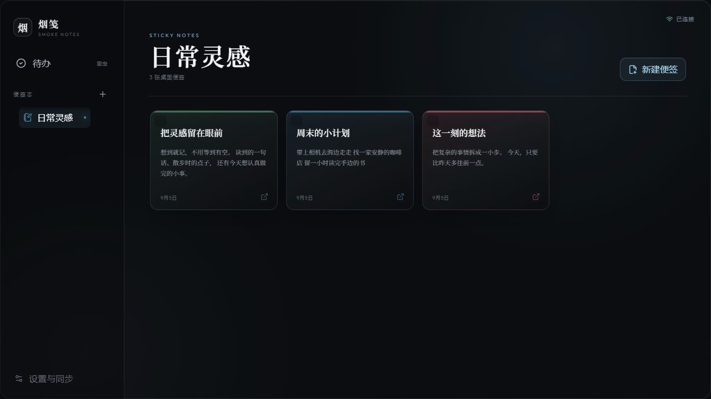
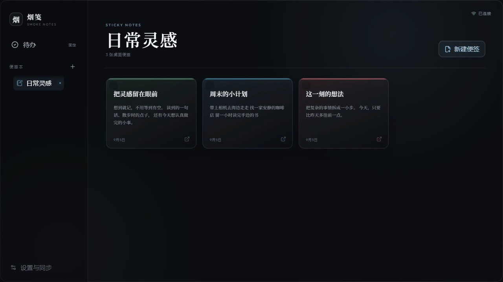

<div align="center">


# 烟笺 · Smoke Notes

**把便签和待办贴在 Windows 桌面，调整背景透明度，让今天要做的事留在眼前。**

Sticky notes and checklists for your Windows desktop, with translucent backgrounds and always-on-top windows.


[](LICENSE)

**[下载 Windows 版 · Download for Windows](https://github.com/ppwwq/smoke-notes/releases/latest/download/SmokeNotes-Setup-0.1.5.exe)**

[版本说明 / Releases](https://github.com/ppwwq/smoke-notes/releases) · [反馈 / Issues](https://github.com/ppwwq/smoke-notes/issues) · [同步部署 / Deployment](DEPLOY.md)

</div>

## 下载与使用 · Get started

下载 **Windows x64 的 0.1.5 安装包**，安装后先建立便签本，再新建普通便签或待办便签。双击卡片即可打开独立便签窗口，无需安装开发工具。

Download the **0.1.5 installer for Windows x64**. Create a notebook, add a note or checklist, and double-click its card to open a separate note window. No developer tools are required.

安装包尚未配置代码签名，Windows 可能显示发布者或信誉提示。请根据下载来源和文件校验信息判断是否安装；SHA-256 见 [验证记录](docs/verification-2026-09-05.md)。

The installer is currently unsigned, so Windows may show a publisher or reputation warning. Review the download source and [SHA-256 verification record](docs/verification-2026-09-05.md) before deciding whether to install.

## 看看界面 · Preview





网页版真实操作画面组成的 18 秒步骤演示，使用示例数据。

An 18-second step walkthrough assembled from real web-app screenshots with sample data.

## 一张便签，刚刚好 · Features

开会时留一张记录，学习时贴一张清单，灵感冒出来时随手写下。

Keep a meeting note, a study checklist, or a quick idea where you can see it.

| 你想做的事 / Use case                       | 烟笺的方式 / What it offers                                                                                                |
| ------------------------------------------- | -------------------------------------------------------------------------------------------------------------------------- |
| 随手记录 / Capture an idea                  | 普通便签、富文本、文字颜色与高亮，输入后自动保存 / Rich text, colors, highlights, and autosave                             |
| 完成今天的事 / Work through a list          | 待办便签内的勾选清单，以及独立待办页面 / Note checklists and a dedicated to-do view                                        |
| 让提醒留在眼前 / Keep a reminder visible    | 独立窗口，调整大小、背景透明度与置顶 / Separate, resizable note windows with background opacity and always-on-top controls |
| 分开工作与生活 / Organize your notes        | 多个便签本、六种便签色、拖动排序 / Multiple notebooks, six note colors, and drag-to-reorder                                |
| 切换最近便签 / Switch between notes         | 侧边最近便签，悬停展开标题 / Recent notes in the sidebar with titles on hover                                              |
| 从电脑接着写到手机 / Continue on your phone | 二维码或六位码配对，可安装到手机主屏幕的 PWA / QR or six-digit pairing and an installable mobile PWA                       |
| 断网时继续记录 / Write offline              | 本地优先保存，恢复连接后自动重试同步 / Local-first storage with sync retries when connectivity returns                     |
| 找回误删内容 / Recover a deleted note       | 即时撤销与「最近删除」 / Undo and Recently Deleted                                                                         |

### 留在桌面，也留得住状态 · Desktop behavior

每张独立便签记住自己的位置、尺寸、透明度与置顶状态。透明度作用于背景，文字保持清晰；主窗口关闭后收进系统托盘。

安装后可在「设置与同步 → 窗口」开启登录 Windows 时启动。登录启动时恢复上次仍打开的便签，主列表保持隐藏。

Each note remembers its position, size, opacity, and always-on-top setting. Background opacity leaves text legible, and closing the main window keeps the app in the system tray. Optional Windows startup restores previously open note windows while keeping the main list hidden.

### 同一份记录，随身继续 · Mobile and sync

电脑端生成一次性配对码，手机加入同一个私人空间。首次配对需要联网；配对后，已有本地便签可以离线打开和编辑。

同步会合并尚未发送的连续修改，保留失败操作以便重试。同一便签出现版本冲突时，会留下本地冲突副本，方便找回两端内容。

Pair your phone with a one-time code from the desktop app. Initial pairing requires a connection; notes already stored locally remain available offline. Sync queues unsent edits and retries failed operations. Conflicting note edits produce a local conflict copy.

**当前发行包使用项目的共享云端配置，相关服务仍处于早期。** 如需自行管理云端与网页部署，请阅读 [部署指南](DEPLOY.md)。本项目不承诺共享服务的长期可用性或无限配额。

**The current release uses the project's shared cloud configuration, which is still an early service.** Long-term availability and unlimited usage are not guaranteed. See [DEPLOY.md](DEPLOY.md) to run your own backend and web app.

## 从源码运行 · Development

需要 **Node.js 22.12+** 和 **pnpm 10.19.0**。Windows 桌面端使用 Electron，手机端可以直接在浏览器中运行。

Requires **Node.js 22.12+** and **pnpm 10.19.0**. The desktop app uses Electron; the mobile app runs in a browser.

```powershell
git clone https://github.com/ppwwq/smoke-notes.git
cd smoke-notes
corepack enable
corepack pnpm@10.19.0 install --frozen-lockfile

# 启动 Windows 桌面端 / Start the Windows desktop app
corepack pnpm@10.19.0 --filter @smoke-notes/desktop dev

# 或启动网页版 / Or start the web app
corepack pnpm@10.19.0 --filter @smoke-notes/web dev
```

桌面开发命令会先生成 Electron 入口。修改主进程或预加载脚本后，重新运行该命令；界面代码支持热更新。

The desktop development command builds the Electron entry points first. Restart it after main-process or preload changes; renderer changes support hot reload.

**不配置云端也可以从源码运行本地便签。** 先建立便签本，再新建普通便签或待办便签。桌面端双击卡片打开独立窗口，手机端点按进入编辑。

**Local notes work without cloud configuration when running from source.** Create a notebook and add a note or checklist. Double-click a desktop card to open its note window, or tap it on mobile to edit.

## 配置手机同步 · Configure sync

将根目录的 `.env.example` 复制为 `.env`，填写自己的配置：

Copy the root `.env.example` to `.env` and provide your own configuration:

```dotenv
VITE_SUPABASE_URL=https://YOUR_PROJECT.supabase.co
VITE_SUPABASE_PUBLISHABLE_KEY=YOUR_PUBLISHABLE_KEY
VITE_WEB_APP_URL=https://YOUR_PROJECT.pages.dev
```

两个应用都读取根目录配置。云端还需启用匿名登录、执行数据库迁移、部署三个边缘函数，并设置服务端 `WEB_APP_URL`。完整步骤见 [部署指南](DEPLOY.md)。

Both apps read the root configuration. The backend also needs anonymous sign-in enabled, database migrations applied, three edge functions deployed, and a server-side `WEB_APP_URL`. Follow [DEPLOY.md](DEPLOY.md) for the complete setup.

## 构建与验证 · Build and verification

```powershell
corepack pnpm@10.19.0 test
corepack pnpm@10.19.0 typecheck
corepack pnpm@10.19.0 lint
corepack pnpm@10.19.0 format:check
corepack pnpm@10.19.0 build

# 生成 Windows 安装包 / Build the Windows installer
corepack pnpm@10.19.0 --filter @smoke-notes/desktop package
```

测试命令会先生成主进程测试需要的构建文件。安装包默认输出到 `apps/desktop/release/`，网页版产物位于 `apps/web/dist/`。

The test command builds the required main-process files first. Installer output defaults to `apps/desktop/release/`; the web build is written to `apps/web/dist/`.

2026-09-05 的本地完整回归为 **20 个测试文件、166 项测试通过**，覆盖数据读写、编辑保存、删除恢复、窗口状态、配对输入及同步队列。这是自动化检查结果；实际手机配对、PWA 更新及注销／重启后的开机启动仍需实机验收。详细范围见 [验证记录](docs/verification-2026-09-05.md)。

The 2026-09-05 regression run passed **166 tests across 20 files**, covering data operations, editing and saving, deletion recovery, window state, pairing input, and sync queues. These are automated results; real-phone pairing, PWA updates, and startup after sign-out or restart still need device acceptance testing. See the [verification record](docs/verification-2026-09-05.md) for scope and limits.

## 项目结构 · Project structure

```text
apps/
  desktop/       Electron 桌面端与 Windows 打包 / Electron desktop and Windows packaging
  web/           手机 PWA 与离线缓存 / Mobile PWA and offline cache
packages/
  core/          本地数据库、数据操作、配对与同步 / Local data, pairing, and sync
  ui/            两端共享界面 / Shared notes, editor, and to-do UI
supabase/
  migrations/    数据库结构与访问控制 / Database schema and access control
  functions/     配对与同步接口 / Pairing and sync endpoints
  tests/         数据库策略与迁移检查 / Database policy and migration checks
```

**主要技术 / Stack:** Electron · React · TypeScript · Vite · Tiptap · Dexie / IndexedDB · Supabase · Vitest.

## 数据与当前边界 · Data and current limitations

- 内容首先保存在设备本地的 IndexedDB。配置云端的构建会自动连接相应 Supabase 项目，同步权限通过私人空间成员和 RLS 隔离。 / Content is stored locally in IndexedDB first. Cloud-configured builds connect to their Supabase project, with sync access controlled by space membership and RLS.
- `.env`、本地数据、安装目录和构建产物均不纳入版本控制。Service Role Key 只能用于服务端。 / Environment files, local data, installed apps, and build output are excluded from version control. Service Role Keys belong only on the server.
- 项目处于早期阶段，尚无内置导入导出。清除浏览器或应用数据前，请自行备份重要记录。 / Built-in import and export are not yet available. Back up important notes before clearing browser or app data.
- 便签本及独立待办的版本冲突采用服务端内容；便签正文冲突另存本地副本。 / Notebook and standalone to-do conflicts use the server version; note-body conflicts keep a separate local copy.

## 一起把小工具打磨好 · Feedback

欢迎通过 [Issues](https://github.com/ppwwq/smoke-notes/issues) 反馈问题或建议。描述操作步骤、预期结果和实际表现，会让问题更容易复现；提交截图前请隐藏私人便签。

Report bugs and suggestions in [Issues](https://github.com/ppwwq/smoke-notes/issues). Include the steps, expected behavior, and actual result, and hide private notes in screenshots.

烟笺采用 [MIT License](LICENSE)，可以使用、修改、分发和商用，请保留版权与许可证声明。

Smoke Notes is released under the [MIT License](LICENSE). You may use, modify, distribute, and use it commercially while preserving the copyright and license notice.
